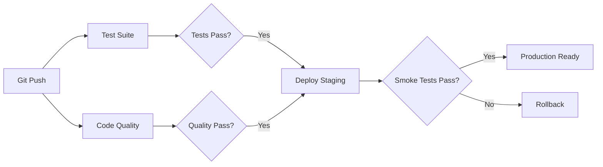

# CI/CD Pipeline Documentation

## Overview

This project uses GitHub Actions for continuous integration and deployment, with automated testing, quality checks, and deployment to Railway.

## Pipeline Architecture



## Workflows

### 1. Test Suite (`test.yml`)

**Triggers:**
- Push to `main`, `develop`, `feature/**`
- Pull requests to `main`, `develop`

**Steps:**
1. Set up Python 3.11 and 3.12
2. Cache pip dependencies
3. Install dependencies
4. Start Redis service
5. Run pytest with coverage
6. Upload coverage to Codecov
7. Generate HTML coverage reports
8. Fail if coverage < 80%

**Artifacts:**
- Coverage reports (XML, HTML)
- Test results

**Duration:** ~3-5 minutes

### 2. Code Quality (`lint.yml`)

**Triggers:**
- Push to `main`, `develop`, `feature/**`
- Pull requests to `main`, `develop`

**Steps:**
1. Set up Python 3.11
2. Install linting tools
3. Run Black (code formatting)
4. Run Flake8 (style guide)
5. Run MyPy (type checking)
6. Run Safety (security scan)
7. Run isort (import sorting)
8. Analyze code complexity

**Quality Tools:**
- **Black**: Code formatting (line length: 100)
- **Flake8**: PEP 8 compliance
- **MyPy**: Type checking
- **Safety**: Dependency vulnerability scanning
- **isort**: Import organization
- **Radon**: Complexity metrics
- **interrogate**: Docstring coverage

**Duration:** ~2-3 minutes

### 3. Staging Deployment (`deploy-staging.yml`)

**Triggers:**
- Push to `main` or `develop`
- Manual workflow dispatch

**Steps:**
1. Run critical tests
2. Deploy to Railway staging environment
3. Wait for deployment
4. Run smoke tests
5. Notify team (Slack)

**Environment:**
- Name: `staging`
- URL: Configured via secrets
- Auto-deploy: Yes

**Required Secrets:**
- `RAILWAY_TOKEN`
- `RAILWAY_STAGING_PROJECT_ID`
- `RAILWAY_STAGING_DOMAIN`
- `ANTHROPIC_API_KEY_STAGING`
- `OPENAI_API_KEY_STAGING`
- `SLACK_WEBHOOK_URL` (optional)

**Duration:** ~5-8 minutes

### 4. Production Deployment (`deploy-production.yml`)

**Triggers:**
- Release published
- Manual workflow dispatch with version tag

**Steps:**
1. **Validation:**
   - Run full test suite
   - Security scanning
   - Coverage validation

2. **Build:**
   - Build Docker image
   - Tag with version
   - Push to Docker Hub
   - Multi-platform support (amd64, arm64)

3. **Deploy:**
   - Create database backup
   - Deploy to Railway production
   - Wait for stability
   - Run integration tests

4. **Verify:**
   - Health checks
   - API endpoint validation
   - Smoke tests

5. **Notify:**
   - Slack notification
   - GitHub deployment record

6. **Rollback (if failure):**
   - Alert team
   - Provide rollback instructions

**Environment:**
- Name: `production`
- URL: Configured via secrets
- Auto-deploy: No (release-based)

**Required Secrets:**
- `RAILWAY_TOKEN`
- `RAILWAY_PRODUCTION_PROJECT_ID`
- `RAILWAY_PRODUCTION_DOMAIN`
- `DOCKER_USERNAME`
- `DOCKER_PASSWORD`
- `ANTHROPIC_API_KEY`
- `OPENAI_API_KEY`
- `SLACK_WEBHOOK_URL` (optional)

**Duration:** ~10-15 minutes

## GitHub Secrets Configuration

### Required Secrets

```bash
# Railway Configuration
RAILWAY_TOKEN                    # Railway CLI authentication token
RAILWAY_STAGING_PROJECT_ID       # Staging project ID
RAILWAY_STAGING_DOMAIN          # Staging domain (e.g., staging.example.railway.app)
RAILWAY_PRODUCTION_PROJECT_ID   # Production project ID
RAILWAY_PRODUCTION_DOMAIN       # Production domain (e.g., app.example.railway.app)

# API Keys
ANTHROPIC_API_KEY               # Production Claude API key
OPENAI_API_KEY                  # Production Whisper API key
ANTHROPIC_API_KEY_STAGING       # Staging Claude API key
OPENAI_API_KEY_STAGING          # Staging Whisper API key

# Docker Hub
DOCKER_USERNAME                 # Docker Hub username
DOCKER_PASSWORD                 # Docker Hub password or token

# Optional
CODECOV_TOKEN                   # Codecov upload token
SLACK_WEBHOOK_URL              # Slack notifications
```

### Setting Secrets

**Via GitHub UI:**
1. Go to repository Settings → Secrets and variables → Actions
2. Click "New repository secret"
3. Add each secret

**Via GitHub CLI:**
```bash
gh secret set RAILWAY_TOKEN
gh secret set ANTHROPIC_API_KEY
# ... etc
```

## Quality Metrics

### Coverage Requirements
- **Minimum:** 80%
- **Target:** 90%+
- **Reports:** Uploaded to Codecov and PR comments

### Code Quality Standards
- **Black:** 100% formatted
- **Flake8:** 0 violations
- **MyPy:** Type hints enforced
- **Complexity:** Max 10 per function
- **Security:** No high-severity issues

## Local Development

### Pre-commit Hooks

Install pre-commit hooks to run quality checks locally:

```bash
pip install pre-commit
pre-commit install
```

Hooks run automatically on `git commit`:
- Trailing whitespace removal
- YAML/JSON validation
- Black formatting
- isort import sorting
- Flake8 linting
- MyPy type checking
- Bandit security scanning

### Manual Quality Checks

```bash
# Format code
black app/ tests/

# Sort imports
isort app/ tests/

# Lint
flake8 app/ tests/

# Type check
mypy app/

# Security scan
bandit -r app/

# Run tests with coverage
pytest tests/ --cov=app --cov-report=html
```

### Local Docker Build

```bash
# Build optimized image
docker build -f Dockerfile.optimized -t learning-voice-agent:local .

# Run container
docker run -p 8000:8000 \
  -e ANTHROPIC_API_KEY=your-key \
  -e OPENAI_API_KEY=your-key \
  -e REDIS_URL=redis://host.docker.internal:6379 \
  learning-voice-agent:local
```

## Deployment Process

### Staging Deployment

**Automatic:**
- Push to `main` or `develop`
- CI/CD runs automatically

**Manual:**
```bash
gh workflow run deploy-staging.yml
```

### Production Deployment

**Via Release:**
1. Create release tag: `git tag v1.0.0`
2. Push tag: `git push origin v1.0.0`
3. Create GitHub release
4. CI/CD triggers automatically

**Manual:**
```bash
gh workflow run deploy-production.yml -f version=v1.0.0
```

## Monitoring and Alerts

### Build Status

Monitor workflow status:
```bash
gh run list --workflow=test.yml
gh run list --workflow=lint.yml
gh run list --workflow=deploy-production.yml
```

### Notifications

**Slack Integration:**
- Deployment success/failure
- Test failures
- Security alerts

**Email Notifications:**
- Configured in GitHub Settings → Notifications

## Rollback Procedures

### Automatic Rollback Triggers
- Integration test failures
- Health check failures
- Critical errors during deployment

### Manual Rollback

**Railway:**
```bash
# Install Railway CLI
npm install -g @railway/cli

# Login
railway login

# Link to project
railway link [PROJECT_ID]

# Rollback to previous deployment
railway rollback
```

**Docker:**
```bash
# Pull previous version
docker pull username/learning-voice-agent:v1.0.0

# Deploy previous version
railway up --detach
```

## Performance Optimization

### Pipeline Speed
- **Dependency Caching:** Reduces install time by ~60%
- **Parallel Jobs:** Test and lint run concurrently
- **Docker Layer Caching:** Speeds up image builds
- **Conditional Steps:** Skip unnecessary steps

### Resource Limits
- **Test timeout:** 10 minutes
- **Lint timeout:** 5 minutes
- **Staging deploy:** 15 minutes
- **Production deploy:** 20 minutes

## Troubleshooting

### Common Issues

**Tests Failing Locally but Pass in CI:**
- Check Python version (3.11)
- Verify Redis is running
- Check environment variables

**Coverage Below 80%:**
- Add tests for uncovered code
- Check `htmlcov/index.html` for details
- Review `coverage.xml` report

**Linting Failures:**
- Run `black app/ tests/` to format
- Run `isort app/ tests/` to sort imports
- Fix Flake8 violations manually

**Deployment Failures:**
- Check Railway logs: `railway logs`
- Verify secrets are set
- Check health endpoint
- Review deployment logs in GitHub Actions

**Docker Build Failures:**
- Check Dockerfile syntax
- Verify all dependencies in requirements.txt
- Test build locally first

## Security Best Practices

### Secrets Management
- Never commit secrets to repository
- Use GitHub Secrets for sensitive data
- Rotate API keys regularly
- Use different keys for staging/production

### Dependency Security
- Safety scan runs on every push
- Bandit scans for code vulnerabilities
- Dependabot alerts for outdated packages
- Pin dependency versions

### Container Security
- Run as non-root user
- Multi-stage builds for minimal images
- No secrets in Docker images
- Regular base image updates

## Metrics and Analytics

### Success Metrics
- Deployment frequency
- Mean time to recovery (MTTR)
- Change failure rate
- Lead time for changes

### Tracking
```bash
# View deployment history
gh api repos/:owner/:repo/deployments

# View workflow runs
gh run list --limit 50

# View workflow analytics
# Visit: https://github.com/[owner]/[repo]/actions
```

## Future Improvements

### Planned Enhancements
- [ ] E2E testing with Playwright
- [ ] Performance benchmarking
- [ ] Automated dependency updates
- [ ] Blue-green deployments
- [ ] Canary releases
- [ ] Load testing in CI
- [ ] Database migration testing
- [ ] API contract testing

### Advanced Features
- [ ] Multi-region deployment
- [ ] A/B testing support
- [ ] Feature flags integration
- [ ] Automated rollback triggers
- [ ] Cost optimization monitoring

## Support

### Resources
- [GitHub Actions Documentation](https://docs.github.com/en/actions)
- [Railway Documentation](https://docs.railway.app/)
- [Docker Best Practices](https://docs.docker.com/develop/dev-best-practices/)

### Getting Help
- GitHub Issues: Project issues
- Railway Discord: Deployment help
- Team Slack: Internal support

---

**Last Updated:** 2025-11-21
**Version:** 1.0.0
**Maintained by:** DevOps Team
