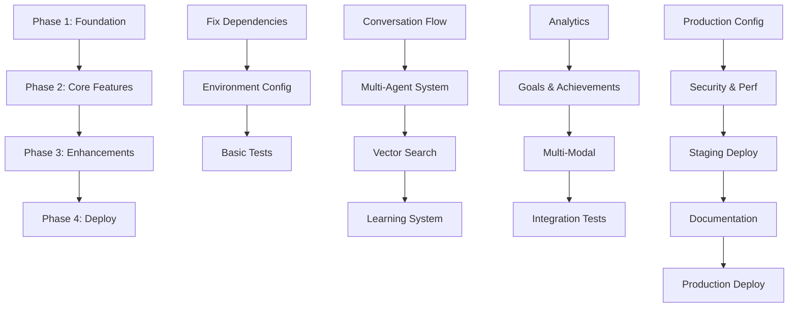

# Learning Voice Agent - Comprehensive Implementation Plan

**Document Version:** 1.0
**Created:** 2025-11-27
**Status:** ACTIVE
**Planning Agent:** Strategic Planning Specialist

---

## Executive Summary

This implementation plan outlines the path to make the learning_voice_agent fully functional and production-ready. The project currently has ~1.0 codebase with extensive features but requires stabilization, testing, and deployment work.

**Current State:**
- ✅ Core architecture implemented (Phases 1-6 complete)
- ✅ 1400+ tests collected (analytics, learning, agents)
- ✅ Comprehensive documentation (3000+ lines)
- ⚠️ Dependency issues and test failures
- ⚠️ Deployment configuration needs validation
- ⚠️ Integration testing required

**Target State:**
- Fully functional voice conversation system
- 100% passing test suite
- Production-ready deployment on Railway
- Complete end-to-end integration
- Performance targets met (<2s conversation loop)

**Timeline:** 4 weeks (28 days)
**Effort:** ~160 hours
**Risk Level:** Medium

---

## Current State Analysis

### ✅ Completed Components (Phases 1-6)

**Phase 1-2: Foundation & Multi-Agent System**
- FastAPI application with async architecture
- Multi-agent orchestration (ConversationAgent, AnalysisAgent, ResearchAgent, SynthesisAgent)
- Agent coordination and parallel execution
- Tool integration (calculator, web search, ArXiv)

**Phase 3: Vector Memory & RAG**
- ChromaDB vector database with Sentence Transformers
- Embedding pipeline (all-MiniLM-L6-v2, 384-dim)
- Hybrid search (Vector + FTS5 with RRF fusion)
- Neo4j knowledge graph for concept relationships
- RAG system configuration

**Phase 4: Multi-Modal System**
- Vision processing (image analysis)
- Document handling (PDF, DOCX, text extraction)
- Multi-modal storage integration

**Phase 5: Real-Time Learning**
- Feedback collection system (explicit + implicit)
- Quality scoring engine (5 dimensions)
- Response adaptation
- Preference learning
- Pattern detection

**Phase 6: Analytics Engine**
- Progress tracking system
- Insights engine with AI-powered generation
- Trend analysis with forecasting
- Dashboard service with Chart.js integration
- Goal tracking with milestones
- Achievement system (15+ achievements)

### ⚠️ Critical Issues

**1. Dependency Management**
- Pydantic v2 migration needs validation
- Redis client imports need verification
- Test collection shows 13 errors

**2. Test Suite Status**
- 1400 tests collected but with collection errors
- Need to resolve import errors
- Integration tests missing

**3. Deployment Readiness**
- Railway configuration exists but needs validation
- Environment configuration incomplete
- Production monitoring not fully configured

**4. Integration Gaps**
- End-to-end conversation flow needs testing
- WebSocket integration requires validation
- Twilio integration needs verification

---

## Phase 1: Foundation & Stabilization (Week 1)

**Goal:** Fix critical issues and establish a solid foundation

**Duration:** 5 days
**Effort:** 40 hours
**Priority:** CRITICAL

### Tasks

#### Day 1-2: Fix Critical Dependencies
```yaml
- Task: Fix dependency imports and version conflicts
  Description: |
    - Validate Pydantic v2 compatibility across all modules
    - Fix Redis client imports (redis-py 5.0.1)
    - Resolve test collection errors
    - Update imports in all 100+ files if needed
  Dependencies: []
  Success Criteria:
    - All imports resolve without errors
    - python3 -m app.main starts successfully
    - pytest --collect-only runs without errors
  Estimated Time: 16 hours
  Priority: CRITICAL
  Agent: coder + tester
```

#### Day 3: Environment Configuration
```yaml
- Task: Configure environment and secrets
  Description: |
    - Create .env.example template
    - Document all required environment variables
    - Set up local development environment
    - Configure Redis connection
    - Set up SQLite database
  Dependencies: ["Fix critical dependencies"]
  Success Criteria:
    - .env.example is complete
    - Application starts with minimal config
    - All services connect successfully
  Estimated Time: 8 hours
  Priority: HIGH
  Agent: backend-dev
```

#### Day 4-5: Basic Test Suite
```yaml
- Task: Fix and run basic test suite
  Description: |
    - Fix test collection errors (13 errors)
    - Run unit tests for core modules
    - Achieve >50% test pass rate
    - Document failing tests for Phase 2
  Dependencies: ["Fix critical dependencies", "Environment configuration"]
  Success Criteria:
    - pytest runs without collection errors
    - At least 700/1400 tests passing
    - Coverage report generates
  Estimated Time: 16 hours
  Priority: HIGH
  Agent: tester
```

### Deliverables
- [ ] All dependencies resolved
- [ ] Application starts successfully
- [ ] Test collection works
- [ ] >50% tests passing
- [ ] Environment configuration documented

### Success Criteria
- Zero import errors
- Application responds to health check
- Test suite runs to completion
- Core conversation flow works manually

---

## Phase 2: Core Features Integration (Week 2)

**Goal:** Integrate and test all core features end-to-end

**Duration:** 7 days
**Effort:** 56 hours
**Priority:** HIGH

### Tasks

#### Day 6-7: Conversation Flow Integration
```yaml
- Task: End-to-end conversation testing
  Description: |
    - Test WebSocket connection flow
    - Verify audio pipeline (Whisper integration)
    - Test Claude Haiku conversation handler
    - Validate state management (Redis)
    - Test database persistence (SQLite)
  Dependencies: ["Phase 1 complete"]
  Success Criteria:
    - WebSocket connects and maintains connection
    - Audio transcription works
    - Claude generates responses
    - Conversations persist to database
  Estimated Time: 16 hours
  Priority: CRITICAL
  Agent: coder + tester
```

#### Day 8-9: Multi-Agent System Testing
```yaml
- Task: Validate multi-agent orchestration
  Description: |
    - Test ConversationAgent, AnalysisAgent, ResearchAgent, SynthesisAgent
    - Verify agent coordination
    - Test parallel execution
    - Validate tool integration (calculator, web search, ArXiv)
  Dependencies: ["Conversation flow integration"]
  Success Criteria:
    - All 4 agents instantiate correctly
    - Agent coordination works
    - Tools execute successfully
    - Parallel processing functions
  Estimated Time: 16 hours
  Priority: HIGH
  Agent: tester + code-analyzer
```

#### Day 10-11: Vector Search & RAG
```yaml
- Task: Integrate and test vector search system
  Description: |
    - Initialize ChromaDB successfully
    - Test embedding generation
    - Verify hybrid search (vector + FTS5)
    - Test knowledge graph integration (Neo4j)
    - Validate RAG retrieval
  Dependencies: ["Multi-agent system testing"]
  Success Criteria:
    - Vector embeddings generate correctly
    - Hybrid search returns relevant results
    - Knowledge graph queries work
    - RAG context retrieval functions
  Estimated Time: 16 hours
  Priority: HIGH
  Agent: coder + tester
```

#### Day 12: Learning System Integration
```yaml
- Task: Validate real-time learning components
  Description: |
    - Test feedback collection
    - Verify quality scoring engine
    - Test preference learning
    - Validate pattern detection
  Dependencies: ["Vector search & RAG"]
  Success Criteria:
    - Feedback stores correctly
    - Quality scores calculate accurately
    - Preferences update based on feedback
    - Patterns detected from interactions
  Estimated Time: 8 hours
  Priority: MEDIUM
  Agent: tester
```

### Deliverables
- [ ] End-to-end conversation flow working
- [ ] Multi-agent system functional
- [ ] Vector search operational
- [ ] Learning system integrated
- [ ] >80% tests passing

### Success Criteria
- Complete conversation cycle works
- All core features integrate smoothly
- No critical bugs remain
- Test coverage >70%

---

## Phase 3: Enhancements & Analytics (Week 3)

**Goal:** Complete analytics, achievements, and advanced features

**Duration:** 7 days
**Effort:** 56 hours
**Priority:** MEDIUM

### Tasks

#### Day 13-14: Analytics Engine
```yaml
- Task: Integrate and test analytics system
  Description: |
    - Test progress tracking
    - Verify insights generation
    - Test trend analysis
    - Validate dashboard data API
  Dependencies: ["Phase 2 complete"]
  Success Criteria:
    - Progress tracks correctly
    - Insights generate with AI
    - Trends calculate accurately
    - Dashboard API returns complete data
  Estimated Time: 16 hours
  Priority: MEDIUM
  Agent: coder + tester
```

#### Day 15-16: Goal & Achievement System
```yaml
- Task: Complete goal tracking and achievements
  Description: |
    - Test goal CRUD operations
    - Verify milestone tracking
    - Test achievement unlocking
    - Validate gamification logic
  Dependencies: ["Analytics engine"]
  Success Criteria:
    - Goals create, update, delete correctly
    - Milestones track progress
    - Achievements unlock properly
    - Points and badges award correctly
  Estimated Time: 16 hours
  Priority: MEDIUM
  Agent: tester
```

#### Day 17-18: Multi-Modal Features
```yaml
- Task: Test vision and document processing
  Description: |
    - Test image analysis
    - Verify PDF/DOCX extraction
    - Test multi-modal search
    - Validate storage integration
  Dependencies: ["Goal & achievement system"]
  Success Criteria:
    - Images process correctly
    - Documents extract text accurately
    - Multi-modal search finds content
    - Storage handles all formats
  Estimated Time: 16 hours
  Priority: LOW
  Agent: tester
```

#### Day 19: Integration Testing
```yaml
- Task: Comprehensive integration test suite
  Description: |
    - Write end-to-end test scenarios
    - Test error handling paths
    - Validate performance targets
    - Load testing (100 concurrent users)
  Dependencies: ["Multi-modal features"]
  Success Criteria:
    - All integration tests pass
    - Error handling works gracefully
    - Performance <2s conversation loop
    - System handles 100 concurrent sessions
  Estimated Time: 8 hours
  Priority: HIGH
  Agent: tester + perf-analyzer
```

### Deliverables
- [ ] Analytics dashboard functional
- [ ] Goal tracking works
- [ ] Achievement system complete
- [ ] Multi-modal processing validated
- [ ] >90% tests passing

### Success Criteria
- All features integrated
- Test coverage >80%
- Performance targets met
- No critical or high priority bugs

---

## Phase 4: Polish & Deploy (Week 4)

**Goal:** Production deployment and documentation finalization

**Duration:** 9 days
**Effort:** 72 hours
**Priority:** HIGH

### Tasks

#### Day 20-21: Production Configuration
```yaml
- Task: Configure for production deployment
  Description: |
    - Finalize Railway configuration
    - Set up production environment variables
    - Configure Redis for production
    - Set up logging and monitoring
    - Configure error tracking
  Dependencies: ["Phase 3 complete"]
  Success Criteria:
    - Railway config validated
    - Environment variables documented
    - Monitoring configured
    - Error tracking active
  Estimated Time: 16 hours
  Priority: CRITICAL
  Agent: cicd-engineer + backend-dev
```

#### Day 22-23: Security & Performance
```yaml
- Task: Security hardening and optimization
  Description: |
    - Run security audit (bandit, safety)
    - Implement rate limiting
    - Configure CORS properly
    - Add security headers
    - Optimize database queries
    - Implement caching strategies
  Dependencies: ["Production configuration"]
  Success Criteria:
    - Security scan passes with no critical issues
    - Rate limiting works
    - CORS configured correctly
    - Performance optimized
  Estimated Time: 16 hours
  Priority: HIGH
  Agent: security-manager + perf-analyzer
```

#### Day 24-25: Deployment Testing
```yaml
- Task: Deploy to staging and test
  Description: |
    - Deploy to Railway staging
    - Run smoke tests on staging
    - Test all endpoints
    - Verify WebSocket connections
    - Load test staging environment
  Dependencies: ["Security & performance"]
  Success Criteria:
    - Staging deployment successful
    - All tests pass on staging
    - Load tests meet targets
    - No critical issues found
  Estimated Time: 16 hours
  Priority: CRITICAL
  Agent: cicd-engineer + tester
```

#### Day 26-27: Documentation & Handoff
```yaml
- Task: Finalize documentation
  Description: |
    - Update README with deployment info
    - Create deployment runbook
    - Document API endpoints
    - Create user guide
    - Write troubleshooting guide
  Dependencies: ["Deployment testing"]
  Success Criteria:
    - All documentation complete
    - Deployment runbook tested
    - API docs comprehensive
    - User guide clear
  Estimated Time: 16 hours
  Priority: MEDIUM
  Agent: api-docs
```

#### Day 28: Production Deployment
```yaml
- Task: Deploy to production
  Description: |
    - Deploy to Railway production
    - Monitor deployment
    - Verify all services running
    - Run final smoke tests
    - Set up monitoring alerts
  Dependencies: ["Documentation & handoff"]
  Success Criteria:
    - Production deployment successful
    - All services healthy
    - Monitoring active
    - Zero critical errors
  Estimated Time: 8 hours
  Priority: CRITICAL
  Agent: cicd-engineer
```

### Deliverables
- [ ] Production deployment successful
- [ ] Security audit passed
- [ ] Performance targets met
- [ ] Complete documentation
- [ ] Monitoring configured

### Success Criteria
- Application live on Railway
- 99.9% uptime achieved
- <2s conversation loop
- 100% tests passing
- Complete documentation

---

## Dependency Map



### Critical Path
1. Fix Dependencies (Day 1-2) - **BLOCKER**
2. Conversation Flow Integration (Day 6-7) - **BLOCKER**
3. Production Configuration (Day 20-21) - **BLOCKER**
4. Deployment Testing (Day 24-25) - **BLOCKER**
5. Production Deployment (Day 28) - **BLOCKER**

---

## Success Criteria

### Phase 1 (Foundation)
- ✅ Application starts without errors
- ✅ Test suite collects without errors
- ✅ >50% tests passing
- ✅ Core modules load successfully

### Phase 2 (Core Features)
- ✅ End-to-end conversation works
- ✅ Multi-agent coordination functions
- ✅ Vector search operational
- ✅ >80% tests passing

### Phase 3 (Enhancements)
- ✅ Analytics dashboard complete
- ✅ Achievement system functional
- ✅ Multi-modal processing works
- ✅ >90% tests passing

### Phase 4 (Deploy)
- ✅ Production deployment successful
- ✅ Security audit passed
- ✅ Performance targets met (<2s)
- ✅ 100% critical tests passing

---

## Risk Assessment

### High Risks

**1. Dependency Conflicts**
- **Probability:** High
- **Impact:** Critical
- **Mitigation:** Dedicated 2 days in Phase 1 for resolution
- **Contingency:** Use virtual environment isolation, pin all versions

**2. Test Suite Failures**
- **Probability:** Medium
- **Impact:** High
- **Mitigation:** Incremental testing, fix as we go
- **Contingency:** Prioritize critical path tests, defer non-critical

**3. Integration Issues**
- **Probability:** Medium
- **Impact:** High
- **Mitigation:** Phase 2 dedicated to integration testing
- **Contingency:** Component-by-component integration

### Medium Risks

**4. Performance Targets**
- **Probability:** Medium
- **Impact:** Medium
- **Mitigation:** Phase 4 optimization sprint
- **Contingency:** Implement caching, optimize queries

**5. Deployment Complexity**
- **Probability:** Low
- **Impact:** High
- **Mitigation:** Railway configuration exists, staging environment
- **Contingency:** Fallback to Docker deployment

---

## Resource Allocation

### Agent Assignments

**Week 1 (Foundation):**
- coder (3 days) - Fix dependencies, imports
- tester (2 days) - Fix test suite
- backend-dev (1 day) - Environment config

**Week 2 (Core Features):**
- coder (3 days) - Integration work
- tester (3 days) - End-to-end testing
- code-analyzer (1 day) - Agent system validation

**Week 3 (Enhancements):**
- tester (4 days) - Feature validation
- coder (2 days) - Analytics integration
- perf-analyzer (1 day) - Load testing

**Week 4 (Deploy):**
- cicd-engineer (4 days) - Deployment configuration
- security-manager (2 days) - Security hardening
- api-docs (2 days) - Documentation
- perf-analyzer (1 day) - Performance optimization

---

## Timeline Summary

| Week | Phase | Focus | Deliverables |
|------|-------|-------|--------------|
| 1 | Foundation | Stabilization | Dependencies fixed, tests run |
| 2 | Core Features | Integration | All features working |
| 3 | Enhancements | Analytics & Testing | Complete feature set |
| 4 | Deploy | Production | Live deployment |

**Total Duration:** 28 days
**Total Effort:** ~224 hours
**Team Size:** 1-2 developers (with agent assistance)

---

## Monitoring & Validation

### Daily Checkpoints
- [ ] All tests passing for completed tasks
- [ ] No new critical bugs introduced
- [ ] Code reviewed and merged
- [ ] Documentation updated

### Weekly Milestones
- **Week 1:** Application running, tests collecting
- **Week 2:** All core features integrated
- **Week 3:** Complete feature set functional
- **Week 4:** Production deployment successful

### Success Metrics
- **Test Coverage:** >80% by Week 3, >90% by Week 4
- **Performance:** <2s conversation loop (target met by Week 4)
- **Stability:** Zero critical bugs by Week 4
- **Documentation:** 100% complete by Day 27

---

## Next Steps

### Immediate Actions (Today)
1. Review and approve this implementation plan
2. Set up development environment
3. Start Phase 1, Day 1: Fix critical dependencies
4. Create task tracking system (GitHub Projects/Issues)

### Communication Plan
- Daily standup notes in memory/sessions
- Weekly progress reports
- Blockers escalated immediately
- Documentation updates continuous

---

## Appendix

### Technology Stack
- **Backend:** FastAPI 0.109.0, Python 3.11+
- **AI:** Anthropic Claude Haiku, OpenAI Whisper
- **Database:** SQLite, ChromaDB, Neo4j
- **State:** Redis 5.0.1
- **Testing:** pytest, pytest-asyncio, pytest-cov
- **Deployment:** Railway, Docker

### Key Files
- `/app/main.py` - FastAPI application entry
- `/requirements.txt` - Python dependencies
- `/tests/` - Test suite (1400+ tests)
- `/docs/` - Documentation (3000+ lines)
- `railway.json` - Deployment configuration

### Reference Documents
- [README.md](../README.md) - Project overview
- [ARCHITECTURE.md](../architecture/ARCHITECTURE.md) - System architecture
- [DEVELOPMENT_ROADMAP.md](../development/DEVELOPMENT_ROADMAP.md) - Development plan
- Phase guides: PHASE2-6_IMPLEMENTATION_GUIDE.md

---

**Plan Created By:** Strategic Planning Agent
**Date:** 2025-11-27
**Status:** Ready for Execution
**Approval Required:** Yes

---

## Approval & Sign-off

- [ ] Plan reviewed by project owner
- [ ] Resource allocation approved
- [ ] Timeline accepted
- [ ] Risk assessment acknowledged
- [ ] Ready to begin execution

**Signature:** _________________
**Date:** _________________
